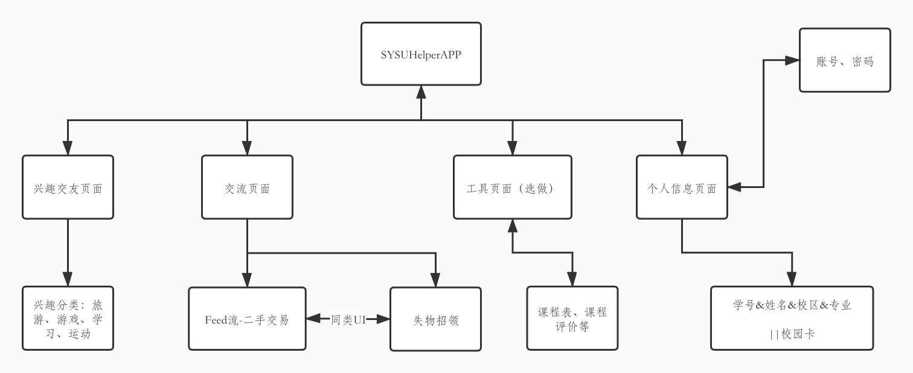
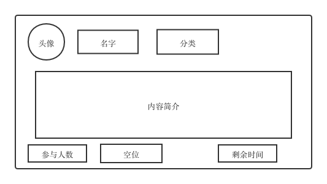
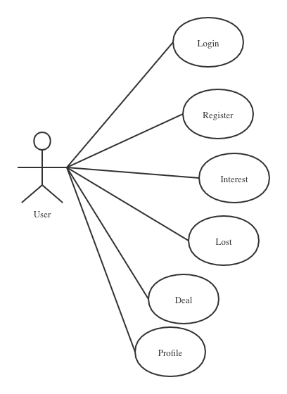
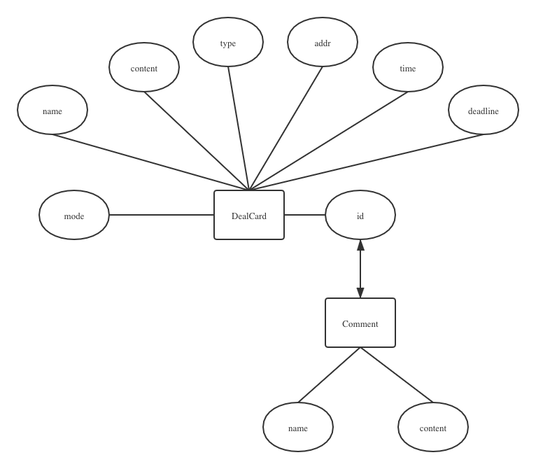
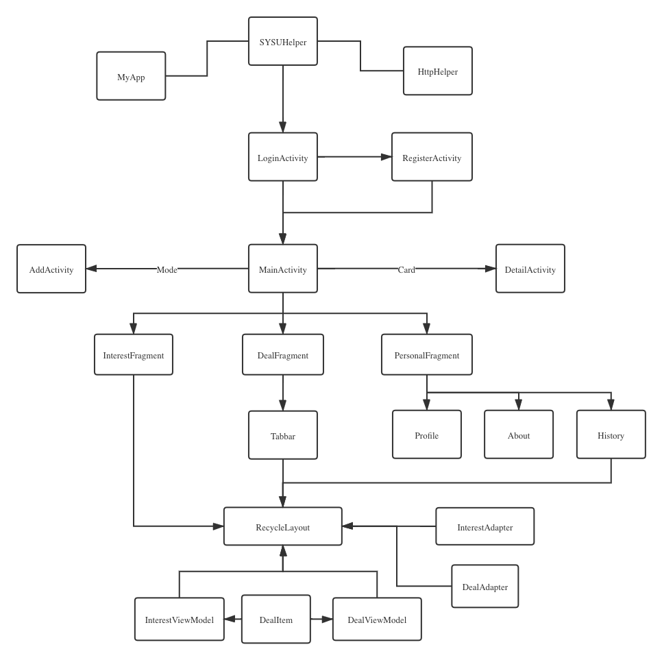
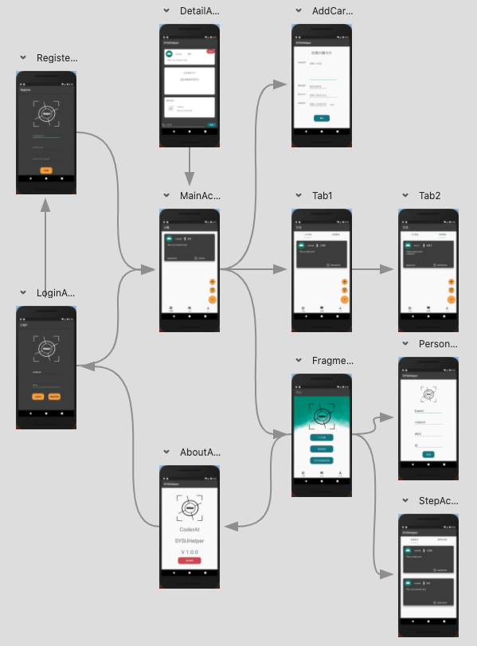

# 中山大学助手（SYSUHelper）

## 成员信息

Ater

## 开发环境

- 操作系统：macOS
- IDE：Android Studio

## 成员分工

- Ater：所有工作（Android前端、Golang服务端、sqlite3数据库）

## 重点&难点

1. 流水显示的RecycleView和ViewModel、Adapter、item之间的结构设计
2. Card不同类型的兼容，以及查询、添加、删除等（工作量大）
3. HTTP多线程及整合
4. 进场动画设计及FabMenu

## 功能信息

1. 实现兴趣交友页面筛选功能
2. 实现二手交易、失物招领的留言、时间限制、排队功能
3. 个人信息输入
4. 历史查询

## 实现方法

### 1. 初步设计





### 2. 筛选类型确定

兴趣：
LOL、篮球、旅行、其他

二手交易：
小型物、大型物、其他

失物招领：
校园卡、手机、其他

### 2. 最终系统实现

#### 用例图



#### 数据库设计




#### 最终系统逻辑设计



#### 程序运行逻辑



## 文件结构

```
.
└── com
    └── example
        └── sysuhelper
            ├── AddCardActivity.java
            ├── MainActivity.java
            ├── MyApp.java
            ├── account
            │   ├── Account.java
            │   ├── LoginActivity.java
            │   └── RegisterActivity.java
            ├── detail
            │   ├── CommentAdapter.java
            │   ├── CommentItem.java
            │   ├── CommentViewModel.java
            │   └── DetailActivity.java
            ├── person
            │   ├── AboutActivity.java
            │   ├── InformationActivity.java
            │   ├── Profile.java
            │   ├── StepActivity.java
            │   └── StepViewModel.java
            ├── tools
            │   ├── HttpHelper.java
            │   └── TokenMsg.java
            └── ui
                ├── dashboard
                │   ├── DashboardFragment.java
                │   ├── DashboardViewModel.java
                │   └── deal
                │       ├── DealAdapter.java
                │       └── DealItem.java
                ├── home
                │   ├── HomeFragment.java
                │   ├── HomeViewModel.java
                │   ├── InterestAdapter.java
                │   └── InterestItem.java
                └── notifications
                    ├── NotificationsFragment.java
                    └── NotificationsViewModel.java
```

